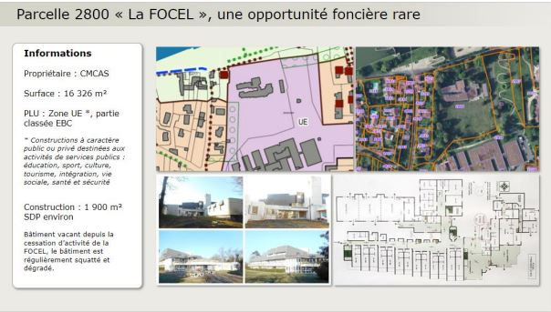

La parcelle dite "La Focel" est une parcelle de 16 326 m² située en bord de Seine à proximité de l'écluse.
Elle abritait autrefois un centre de vacances et de loisirs pour enfants. Elle est actuellement en friche depuis sa fermeture.

> Voir plan : les rues adjacentes sont la Rue de l'Ile Saint-Pierre et Rue François Aussavis [Lien GoogleMaps](https://goo.gl/maps/ZyMpQDTMEHB4kbga8).

***Rappels***

En Novembre 2021, la Mairie de Bois-le-Roi a communiqué sur le fait que cette parcelle devait être cédée sous peu par son propriétaire, le CMCAS EDF. Ce qui avait alors posé la question de son avenir et de son intérêt pour Bois-le-Roi déclenchant des débats animés entre les citoyens et les différents acteurs de la vie locale de Bois-le-Roi en fin d'année 2021 et au début 2022.

La Mairie de Bois-le-Roi avait alors présenté une idée de projet de logements sociaux sur cette parcelle dans le cadre du groupe de travail "Logements abordables" réunissant des élus et des associations de Bois-le-Roi. Ce projet était alors présenté comme urgent et justifiait le recours rapide à l'Etablissement Public Foncier d'Ile-de-france (EPFIF) pour son financement au travers de la signature d'une convention d'intervention foncière. De plus, ce projet d'envergure permettait de répondre aux objectifs de logements sociaux requis par la loi SRU pour la commune de Bois-le-Roi.

Cela avait alors suscité des inquiétudes et des questionnements de la part des citoryens, des riverains et des associations qui s'étaient exprimés sur les sujets EPFIF, Focel et loi SRU par divers courriers.

***Où en sommes-nous aujourd'hui ?***

Plus de nouvelles depuis plusieurs mois. Aucune information publique au sujet de l'avenir de cette parcelle.

**Ce que nous savons:**
- Suite aux fortes oppositions, la convention avec l'EPFIF n'a pas été signée par la Mairie.
- *Information à confirmer:* La Mairie aurait fait une offre d'achat pour la parcelle de la FOCEL mais l'offre n'aurait pas été retenue par le CMCAS EDF face à une meilleure offre d'un acteur privé. 
- *Information à confirmer:* Le terrain n'aurait pas encore été cédé mais quelques bruits circuleraient à propos d'une offre d'achat qui aurait été retenue par le propriétaire du terrain mais aucune information officielle n'a été réalisé sur le sujet à notre connaissance à ce jour (18/07/2022).

**Nous espérons donc en savoir plus dans les semaines et les mois qui viennent afin que les bacots puissent être informés du futur de cette parcelle sur leur commune.**

A ce titre et en concertation avec les principales associations et collectif de Bois-le-Roi, **le média lesbacots.org** a préparé un questionnaire qui serait destiné au(x) porteur(s) de projet. L'objectif étant de mieux comprendre les contours et les impacts du projet qui sera retenu. Nous serions donc ravis de pouvoir le partager et de le compléter avec le(s) porteur(s) de projet concerné(s).

*N'hésitez pas à nous contacter si vous souhaitez nous mettre en relation avec le(s) porteur(s) de projet ou nous partager des informations à ce sujet. lemedia@lesbacots.org*
